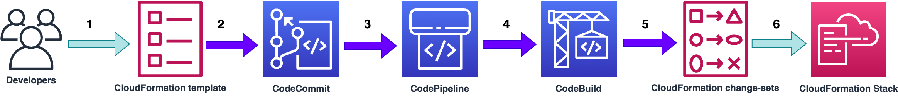

# Streamlining CI/CD Pipelines: AWS CloudFormation's Latest Features in action.

This repository contains sample CloudFormation template file to test "RetainExceptOnCreate", "OnStackFailure", and "ImportExistingResources" features. It also contains buildspec.yml file to create and update the CloudFormation stack using CodeBuild. 

# Solution Overview

CodePipeline can be used to streamline the process of creating, modifying, and terminating CloudFormation stacks. The pipeline will have two stages:

* Source stage: This stage will store the required CloudFormation template, buildspec.yml and parameter files. 
* Build stage: This stage will create, update, or delete the CloudFormation stack based on the changes detected in the source stage files.

## Requirements

* [Create an AWS account](https://portal.aws.amazon.com/gp/aws/developer/registration/index.html) if you do not already have one and log in. The IAM user that you use must have sufficient permissions to make necessary AWS service calls and manage AWS resources.
* A source repository, this can be any of the source that is currently supported by CodePipeline. eg: CodeCommit, GitHub, BitBucket etc. 
* A CodeBuild project build using the latest Amazon Linux 2023 x86 image or latest Ubuntu OS [image](https://docs.aws.amazon.com/codebuild/latest/userguide/build-env-ref-available.html#ec2-compute-images).
* A CodePipeline pipeline that has 2 stages, source stage and build stage. 

----

## License

This library is licensed under the MIT-0 License. See the LICENSE file.

## My Project

TODO: Fill this README out!

Be sure to:

* Change the title in this README
* Edit your repository description on GitHub

## Security

See [CONTRIBUTING](CONTRIBUTING.md#security-issue-notifications) for more information.

